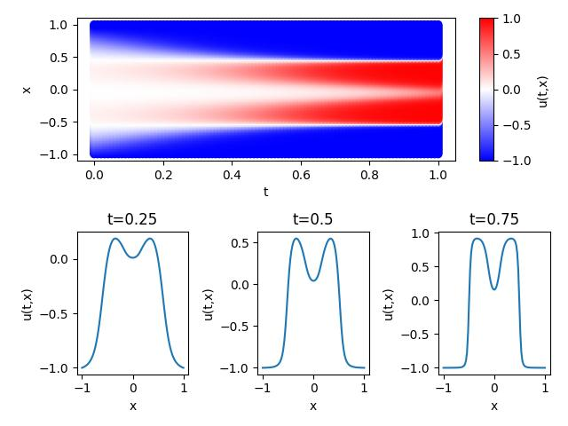
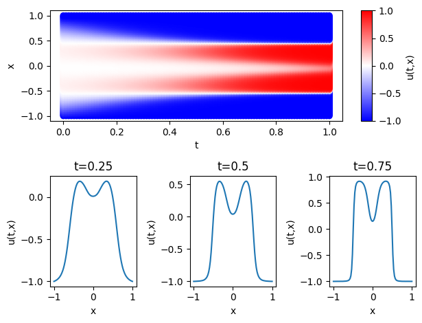

# Allen-Cahn 方程求解 - PINNs 实现

## 概述

本项目使用 **MindFlow** 套件和 **MindSpore** 实现基于物理驱动神经网络（PINNs, Physics-Informed Neural Networks）的 Allen-Cahn 方程求解。  
Allen-Cahn 方程是一种非线性反应-扩散方程，描述多组分合金系统中的相分离过程。项目通过神经网络学习映射 $(x, t) \mapsto u(x, t)$，无需传统网格划分，高效预测时空分布。

- **定义域**: $x \in [-1, 1]$, $t \in [0, 1]$
- **方程**:
$$
\frac{\partial u}{\partial t} = 0.001 \frac{\partial^2 u}{\partial x^2} + 5(u - u^3)
$$
- **边界条件**: $u(-1, t) = -1$, $u(1, t) = -1$
- **初始条件**: $u(x, 0) = x^2 \cos(\pi x)$

结果展示出相分离特性（系统分裂为 $u \approx \pm 1$ 的稳定相）和动态演化（界面向稳定态收敛），见可视化图。

## 依赖

- **MindSpore >= 2.0.0**: 支持函数式编程和自动微分，安装参考 [MindSpore 安装指南](https://www.mindspore.cn/install)
- **MindFlow >= 0.1.0**: 流体模拟套件

## 使用方法

### 运行项目

此项目支持 GPU 和 ASCEND，运行时需要选择对应的镜像和硬件资源。
打开 `allen_cahn_gpu.ipynb` 或者 `allen_cahn_ascend.ipynb`，按照以下步骤运行：

1. 执行所有代码单元，加载依赖和配置文件；
2. 如需修改训练参数，编辑 `configs/allen_cahn_cfg.yaml`（例如 `train_epochs`、`visual_resolution`）；
3. 执行完整训练流程，生成结果图。

### 输出

- **检查点**: 模型保存在 `./ckpt` 目录，包括 `ac-optimal.ckpt`（最优模型）与 `ac-<epoch>.ckpt`；
- **可视化结果**: 训练结束后生成时空分布图和时间截面图，展示 $u(x, t)$ 的动态演化过程。

### 主要配置说明

配置文件 `configs/allen_cahn_cfg.yaml` 控制训练和模型行为，关键参数如下：

- **geometry**:
  - `coord_dim: 1`, `time_dim: 1`: 定义一维空间和时间域。
  - `coord_min: -1.0`, `coord_max: 1.0`: 空间范围 $x \in [-1, 1]$。
  - `time_min: 0.0`, `time_max: 1.0`: 时间范围 $t \in [0, 1]$。可根据问题调整定义域。
- **data**:

  - `domain.size: 8192`: 定义域内采样点数，影响 PDE 残差精度，增大可提升准确性但增加计算量。
  - `time.size: 8192`: 时间维度采样点数，与空间点数匹配。
  - `BC.size: 800`, `IC.size: 400`: 边界和初始条件采样点数。
  - `random_sampling: true`, `sampler: "uniform"`: 使用均匀随机采样。

- **model**:

  - `in_channels: 2`, `out_channels: 1`: 输入 $(x, t)$，输出 $u(x, t)$。
  - `layers: 6`, `neurons: 128`: 网络深度和宽度，增加可增强拟合能力。
  - `activation: "tanh"`, `residual: true`: 激活函数和残差连接，适合非线性问题。

- **optimizer**:

  - `initial_lr: 0.0001`: 初始学习率，过高可能导致不收敛，建议微调。
  - `warmup_epochs: 1`, `gamma: 0.5`: 学习率预热和衰减参数，控制训练稳定性。
  - `weight_decay: 0.0`: 无权重衰减，可根据过拟合情况调整。

- **全局参数**:
  - `train_epochs: 200`: 训练轮次，增大可改善收敛。
  - `train_batch_size: 400`: 批次大小，影响内存使用和收敛速度。
  - `eval_interval_epochs: 100`, `save_checkpoint_epochs: 100`: 评估和保存间隔。
  - `test_dataset_path: "../dataset/1"`: 测试数据路径，需确保有效。
  - `save_ckpt_path: "../ckpt/1"`, `load_ckpt_path: "../ckpt/1/ac-5000.ckpt"`: 模型保存和加载路径。

### 文件说明

| 文件 / 文件夹                 | 描述                               |
| ----------------------------- | ---------------------------------- |
| `Allen_Cahn_gpu.ipynb`            | 主 Notebook，包含训练流程与可视化，使用 GPU 训练  |
| `Allen_Cahn_ascend.ipynb`            | 主 Notebook，包含训练流程与可视化，使用 ASCEND 训练  |
| `configs/allen_cahn_cfg.yaml` | 模型与训练配置                     |
| `src/`                        | 模块代码                           |
| ├── `model.py`                | PDE 损失计算和多尺度神经网络结构和 |
| ├── `dataset.py`              | 数据集制作                         |
| ├── `utils.py`                | 可视化与误差评估                   |
| `dataset/`                    | 数据集目录                         |
| `images/`                     | 可视化结果保存路径                       |
| `ckpt/`                       | 模型保存路径                       |

## 结果展示

|   参数   |                           Ascend                            |                                     GPU                                     |
| :------: | :---------------------------------------------------------: | :-------------------------------------------------------------------------: | 
| 硬件资源 |                   Ascend: 1\*Ascend Snt9                    |                            GPU: 1\*Tnt004 (16GB)                            |
|   镜像   | mindspore_2.1.0-cann_6.3.2-py_3.7-euler_2.10.7-aarch64-d910 | [mindspore_2.0.0-cuda_11.6-py_3.9-ubuntu_20.04-x86_64-20230822144810-5af8ecb](https://developer.huaweicloud.com/develop/aigallery/article/detail?id=4f38538b-25ce-45ca-8f73-dcffcbfe2110) |
|   损失   |                           1.9e-05                           |                                  0.78e-05                                   |
|   速度   |                        0.7s / epoch                         |                                0.5s / epoch                                 |

### 数据集一可视化

### 数据集二可视化

### 分析

- **时空分布图** $u(x, t)$ 在 $x = \pm 1$ 始终为 $-1$，中心区域随 $t$ 增加形成 $u \approx 1$ 并逐渐变窄，符合 Allen-Cahn 方程的**相分离特性**(系统自发分裂为 $u \approx \pm 1$ 的稳定相)。

- **时间截面图** $u(x)$ 从宽峰逐步变窄，中心 $u \approx 1$，两侧 $u \approx -1$，反映出动态演化过程，即非线性项驱动界面向稳定态收敛。

- 图像特征与 Allen-Cahn 方程的理论行为高度一致。
